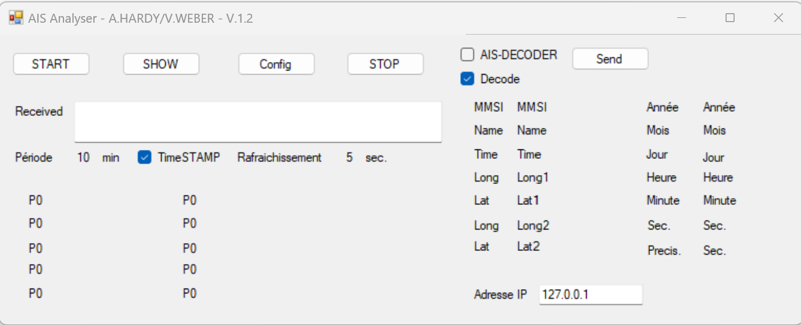

# AIS_Analyser

  Collect DATA from AIS (Automatic Identification System) (add link), filter on particular boats, compute and display navigation values.  - VB.net - 2015
  This software was developped in collaboration between [Adrien Hardy](https://fr.wikipedia.org/wiki/Adrien_Hardy_(voile)) during 2015 and used during some [FIGARO](https://fr.wikipedia.org/wiki/Solitaire_du_Figaro_2015) and [IMOCA-TJV](https://fr.wikipedia.org/wiki/Transat_Jacques-Vabre_2015) regatta.
      

# Table of contents

- [Usage](#usage)
- [Installation](#installation)
- [Support](#Support)
- [Project status](#Project-status)
- [License](#license)

# Usage

[(Back to top)](#table-of-contents)
The programm is listenning to the port UDP 1024 to collect data from AIS.
On start the program check if configuration files exists, if not it'll ask if you want to specifie one particular, 
this file define which MMSI Identification number you want to follow, the boat name can be aliased if needed (syntax is on each line : MMSI_Number;BoatNameAlias).

On main sheet, Click on START to begin to listen.

You can show, by clicking "SHOW" the navigation values of the boats that you can

For developping evironement, ther is a possibility to simulate AIS Flow by extending the main window to the right, click send, it'll broadcast to UDP 127.0.0.1:1024, some AIS values stored into the program.

You can see below a full environement, when its runs, with the map plotter in the background.

# Installation

[(Back to top)](#table-of-contents)
  
  Source code developped on visual Studio in VB.net.

# Project status

[(Back to top)](#table-of-contents)

    Project is still active for personal use on OSIRIS and IRC rules, and has been translated to Python. 
	

# License

[(Back to top)](#table-of-contents)
	
